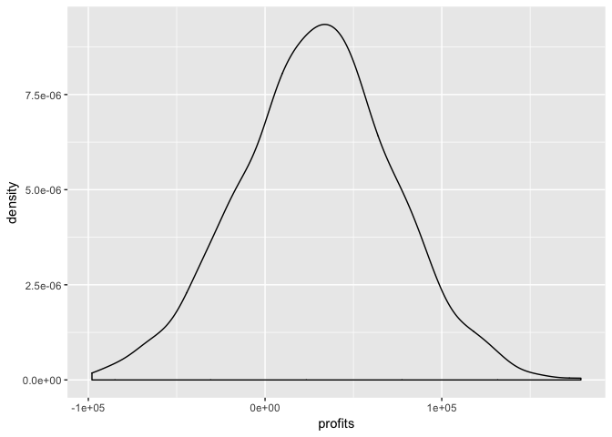
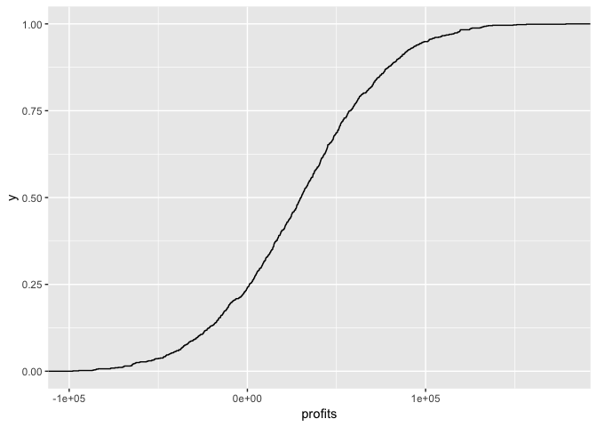

README
================

``` r
library(tidyverse)
```

    ## ─ Attaching packages ───────────────────────────────────────── tidyverse 1.2.1 ─

    ## ✔ ggplot2 3.1.0     ✔ purrr   0.3.0
    ## ✔ tibble  2.0.1     ✔ dplyr   0.7.8
    ## ✔ tidyr   0.8.2     ✔ stringr 1.4.0
    ## ✔ readr   1.3.1     ✔ forcats 0.3.0

    ## ─ Conflicts ────────────────────────────────────────── tidyverse_conflicts() ─
    ## ✖ dplyr::filter() masks stats::filter()
    ## ✖ dplyr::lag()    masks stats::lag()

``` r
dat <- read_csv('Data/cpl_and_conversion.csv') %>% as_tibble()
```

    ## Parsed with column specification:
    ## cols(
    ##   cost_per_lead = col_double(),
    ##   conversion_rate = col_double()
    ## )

``` r
set.seed(1212)
# question 1 --------------------------------------------------------------

calc_profit <- function(x = 1212){
  L <- sample(3000:4000, 30, replace = T)
  R <- rnorm(n = 30, mean = 0.04, sd = 0.005)
  M <- sample(350:400, 30, replace = T)
  H <- 20000
  Cpl <- sample(8:10, 30, replace = T)
  Total_profit <- 0
  
  for (i in 1:30) {
    Income <- L[i] * R[i] * M[i]
    Expenses <- H + Cpl[i] * L[i]
    Profit <- Income - Expenses
    Total_profit <- Profit + Total_profit}
  
  return(Total_profit)
}

trials = 1000
result <- replicate(trials, calc_profit())
result <- result %>% as_tibble() %>% 
  mutate(profits = as.integer(value)) %>% 
  select(profits)
```

    ## Warning: Calling `as_tibble()` on a vector is discouraged, because the behavior is likely to change in the future. Use `enframe(name = NULL)` instead.
    ## This warning is displayed once per session.

第一题
------

``` r
result %>% 
  ggplot(aes(profits))+
    geom_density()
```



``` r
print(quantile(result$profits,probs = c(0.025,0.975)))
```

    ##      2.5%     97.5% 
    ## -60607.35 117875.90

第二题
------

### 概率是

``` r
p_up_10w = nrow(result[which(result$profits >= 100000),])/1000
print(p_up_10w)
```

    ## [1] 0.051

第三题
------

``` r
result %>% 
  ggplot(aes(profits))+
  stat_ecdf()
```


